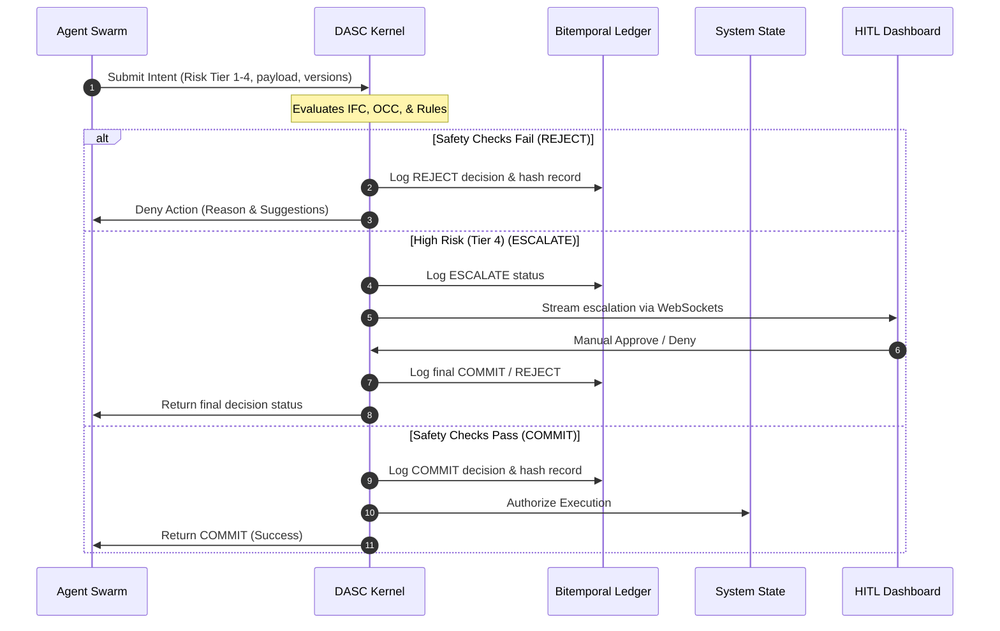

# DASC-Core: Deterministic Agentic Swarm Control

**The Safety Boundary for Probabilistic Intelligence.**

DASC is a high-performance, multi-language middleware designed to prevent AI hallucinations from becoming real-world disasters. It intercepts agent intents and enforces deterministic safety checks before any action is committed to your authoritative systems.

---

## 🏗️ Architecture & Positioning

DASC introduces a **Commitment Boundary** that separates the probabilistic reasoning of LLMs from the authoritative state of your databases, file systems, and APIs.

```mermaid
graph TD
    subgraph "Probabilistic Layer (AI Reasoning)"
        A[LangGraph / CrewAI / AutoGen Agent]
    end

    subgraph "DASC Safety Layer (Deterministic Control)"
        B[DASC Client / Adapter] -->|Submit Intent| C[DASC Safety Kernel (FastAPI / Express)]
        C -->|1. Validate Schema| D[Pipeline]
        C -->|2. IFC Taint Check| D
        C -->|3. Semantic OCC| D
        C -->|4. Policy Evaluation| D
        C -->|Log Decision| E[(Hash-Chained Ledger)]
    end

    subgraph "Authoritative Layer (Committed Actions)"
        D -->|COMMIT| F[(Database / API / Shell)]
        D -->|REJECT| A
        D -->|ESCALATE| G[Control Plane Dashboard]
        G -->|HITL Approval/Deny| C
    end
```

---

## 🔄 Interaction Workflow

The sequence below illustrates how an intent is evaluated, handled, logged, and escalated dynamically:



---

## 📦 Distribution

### Node.js (Official SDK)
[](https://www.npmjs.com/package/@antenehtessema/dasc-core)
```bash
npm install @antenehtessema/dasc-core
```

### Python (Core Middleware)
```bash
pip install dasc-core
```

---

## 🚀 Native Framework Integrations

DASC provides plug-and-play adapters to secure popular orchestration platforms:

### 1. LangGraph (Python)
Integrate safety nodes and bitemporal checkpointers directly in your graphs:
```python
from langgraph.graph import StateGraph
from dasc import Kernel
from dasc_langgraph import DASCLangGraphAdapter, DASCLangGraphCheckpointer

kernel = Kernel()
adapter = DASCLangGraphAdapter(kernel)
checkpointer = DASCLangGraphCheckpointer()

# Define graph and inject DASC
workflow = StateGraph(AgentState)
workflow.add_node("safety_gate", adapter.safety_node)
workflow.set_entry_point("safety_gate")

workflow.add_conditional_edges(
    "safety_gate",
    adapter.route_decision,
    {
        "authorized": "execute_node",
        "human_gate": "escalation_node",
        "rejected": "rejection_node"
    }
)
app = workflow.compile(checkpointer=checkpointer)
```

### 2. CrewAI (Python)
Intercept and validate Crew task outputs before they are committed:
```python
from crewai import Agent
from dasc import Kernel
from dasc.adapters.crewai import CrewDASCConnector

kernel = Kernel()
safety_tool = CrewDASCConnector(kernel=kernel)

agent = Agent(
    role="Database Executor",
    goal="Safely perform operations on the user database",
    tools=[safety_tool],
    verbose=True
)
```

---

## 🛡️ Core Safety Pipelines

1.  **IFC / Taint Check**: Intercepts untrusted data flows. If an intent is proposed with an `untrusted` evidence source at `Risk Tier >= 2`, it blocks it from executing.
2.  **Semantic Optimistic Concurrency Control (OCC)**: Performs TOCTOU checks using state version vectors or file hashes. If target artifacts drift between reasoning and execution, DASC rejects the write.
3.  **Declarative JSON Rules**: Prebuilt or custom policies configured via simple rule JSON files (e.g. Cybersecurity command injection detection, Finance spending limits, or Healthcare HIPAA checks).
4.  **Bitemporal Ledgers**: Logs all committed and rejected intents in a hash-chained, tamper-evident SQLite/PostgreSQL database for immutable compliance auditing.

---

## 🖥️ Control Plane Console

DASC includes a self-contained Next.js control plane interface. When you install `dasc-core` via `pip`, the compiled static dashboard is bundled and hosted directly by the FastAPI server.

To start the Control Plane (API & Dashboard):
```bash
dasc serve --port 8000
```
Then simply open your browser and navigate to:
👉 **`http://localhost:8000`**

### Console Features:
*   **Bidirectional WebSockets**: Stream agent requests and decisions in real-time.
*   **Bitemporal Time Travel**: A history debugger datetime slider to inspect prior system state baselines.
*   **Human-In-The-Loop (HITL)**: Instant administrative approve/deny controls for escalated intents.
*   **Audit Chain Integrity**: Perform one-click verification of the ledger's cryptographic hash chain.
*   **Safety Policies Manager**: View active declarative policies and dynamically rewrite safety rules with live-reloaded schema enforcement using the embedded JSON policy editor and templates.

---

## 📝 Configurable Declarative Policies

DASC loads policy rules from `dasc_rules.json` in the root execution directory. This file is automatically generated with default templates if not present on startup.

### Rule Schema:
Rules are specified as a JSON object with a `"rules"` list:
```json
{
  "rules": [
    {
      "name": "Financial Spend Limit",
      "condition": "payload.amount > 1000 and risk_tier < 3",
      "action": "REJECT",
      "reason": "SPENDING_LIMIT_EXCEEDED"
    },
    {
      "name": "Nuke Command Verification",
      "condition": "action_type == 'NUKE'",
      "action": "ESCALATE",
      "reason": "NUKE_COMMAND_HITL"
    }
  ]
}
```

*   **`name`**: A descriptive name for the safety policy.
*   **`condition`**: A boolean evaluation query supporting operators `==`, `!=`, `>=`, `<=`, `>`, `<`, `contains`, `in`, and logical chaining (`and`). Can query nested fields of the submitted `Intent` object (e.g. `payload.amount` or `target_artifact`).
*   **`action`**: Can be `COMMIT` (allow), `REJECT` (deny), or `ESCALATE` (trigger human-in-the-loop approval gate).
*   **`reason`**: The unique rejection or escalation code passed back to the orchestrator.

### Dynamic Updates API:
Safety policies can also be programmatically updated at runtime via the API (using authentication headers):
*   **`GET /policies`**: Retrieve all active policies.
*   **`POST /policies`**: Override the rules config file and hot-reload rules in memory instantly without restarting the server.

---

## ⚖️ License
MIT © 2026 Anteneh T. Tessema
