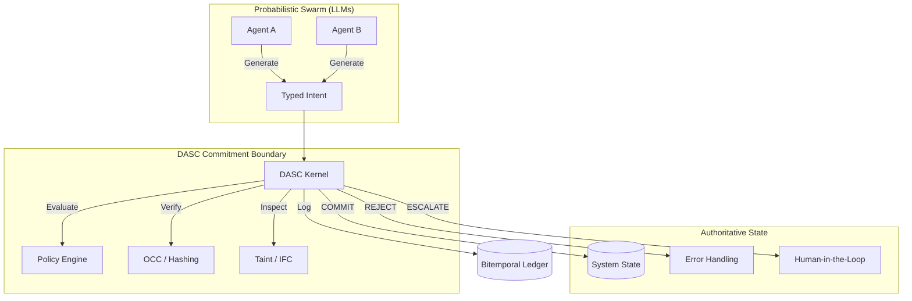
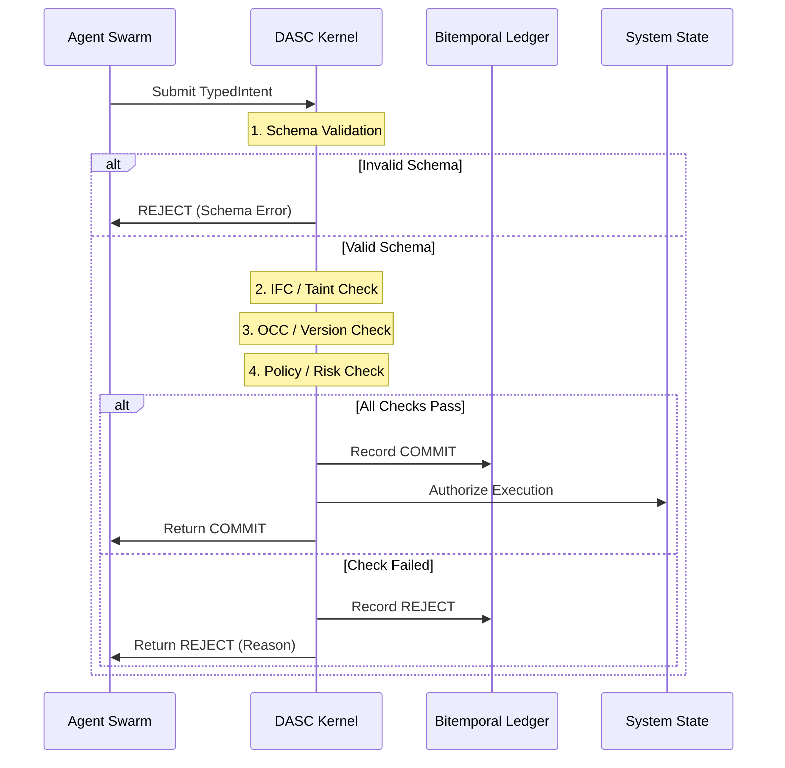

# DASC Architecture

This document describes the high-level architecture and deterministic logic flow of the Deterministic Agentic Swarm Control (DASC) middleware.

## System Overview

DASC acts as a **Commitment Boundary** between a probabilistic multi-agent swarm and the authoritative system state.

## Intent Evaluation Pipeline

Every intent passes through a linear, deterministic pipeline. If any stage fails, the process halts immediately with a `REJECT` status.

## Bitemporal Ledger Schema

DASC maintains a SQLite-backed ledger that records not just what happened, but **what was known** at the time of the decision.

| Field | Description |
| :--- | :--- |
| `intent_id` | Unique identifier for the action proposal. |
| `actor_agent` | The specific agent that generated the intent. |
| `status` | COMMIT, REJECT, or ESCALATE. |
| `reason_codes` | Deterministic reasons for the decision. |
| `intent_json` | Full snapshot of the original intent for replayability. |
| `timestamp` | UTC ISO-8601 timestamp of the decision. |
