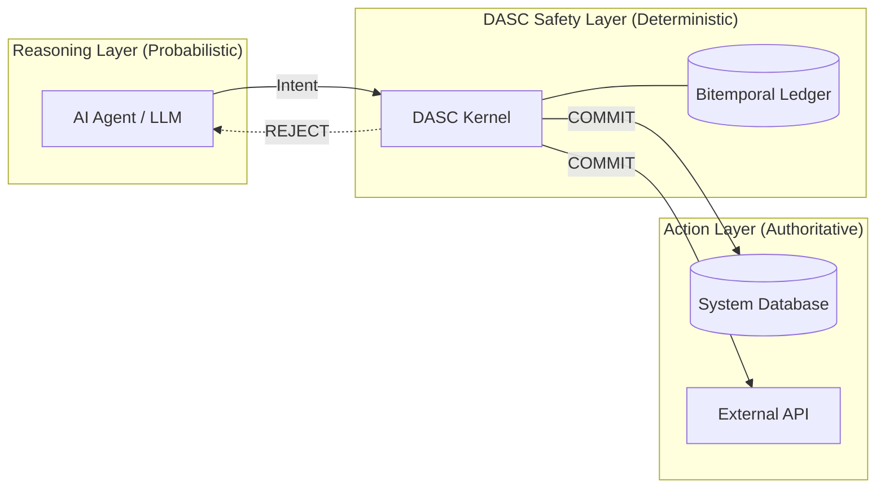

# DASC-Core Architecture

## 🏁 The Commitment Boundary

DASC operates as a "Safety Gate" between an agent's probabilistic reasoning and the system's authoritative state.

## 🛡️ The Linear Safety Pipeline

Every intent passes through a strictly ordered evaluation sequence:

1.  **IFC (Information Flow Control)**: Validates that the evidence provided for an action is from a trusted source.
2.  **OCC (Optimistic Concurrency Control)**: Uses version vectors to ensure the agent hasn't hallucinated a world state that has since changed.
3.  **Policy Engine**: Enforces industry-specific deterministic rules (Cyber, Finance, Healthcare).
4.  **Audit Persistence**: Every decision is hash-chained to the previous one in the SQLite ledger, ensuring a tamper-evident record.

## 🔗 Multi-Language Synchronization

DASC maintains identical logic across Python and Node.js to support heterogeneous agent swarms.

- **Python Core**: Best for data-heavy and LLM-native agents.
- **Node.js SDK**: Best for web-facing agents and serverless environments.
- **Control Plane**: A shared Next.js dashboard that aggregates safety logs from both environments.

## 🔒 Security Hardening
- **SHA-256 Hash Chaining**: Prevents "Audit Fraud" by ensuring logs cannot be rewritten.
- **PII Sanitization**: Automatically redacts sensitive patterns (SSNs, Emails) before logging.
- **Semantic Hashing**: Allows the OCC engine to compare complex world states (Files, Configs) using deterministic hashes.
